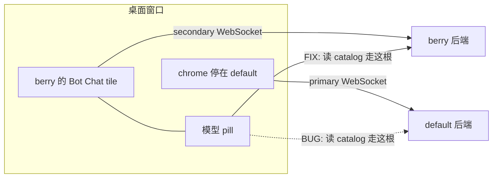
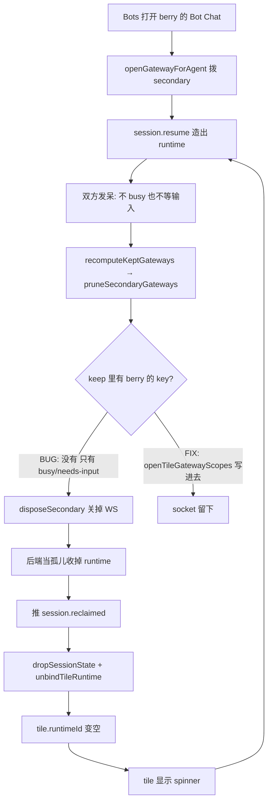
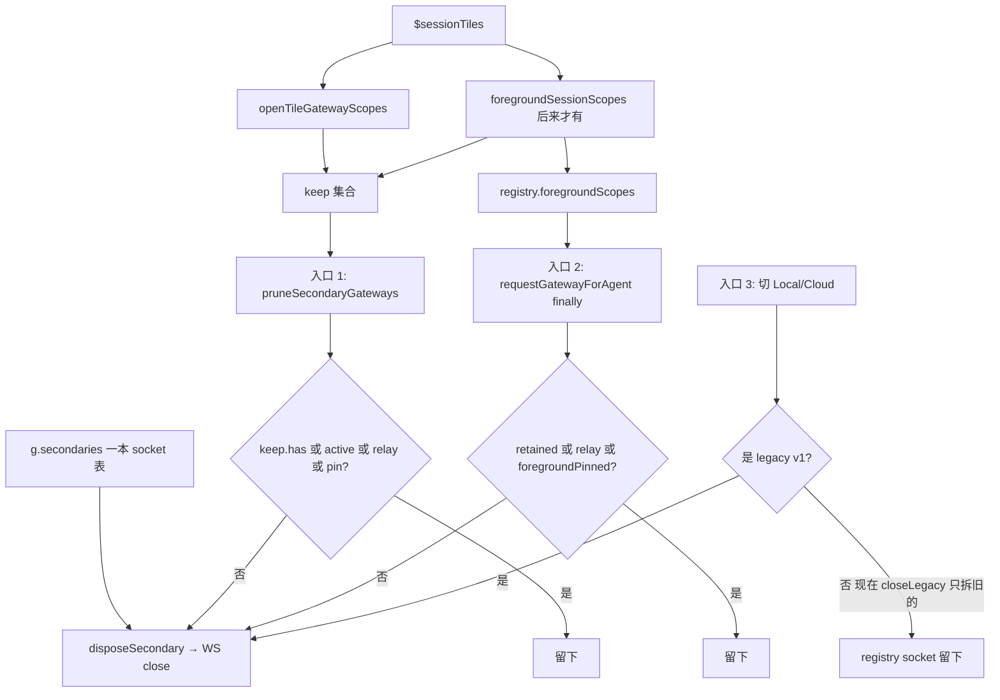
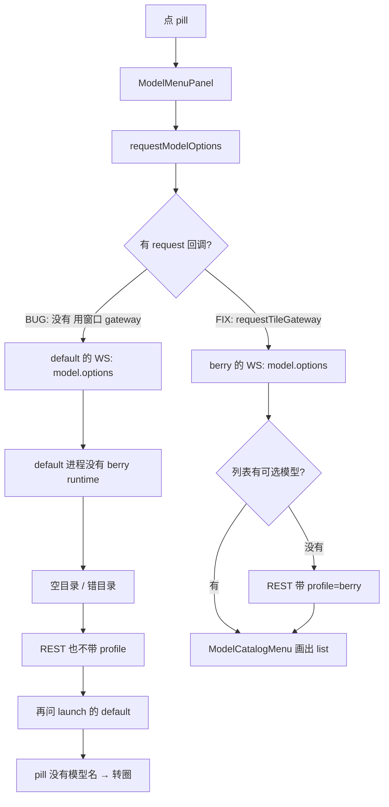
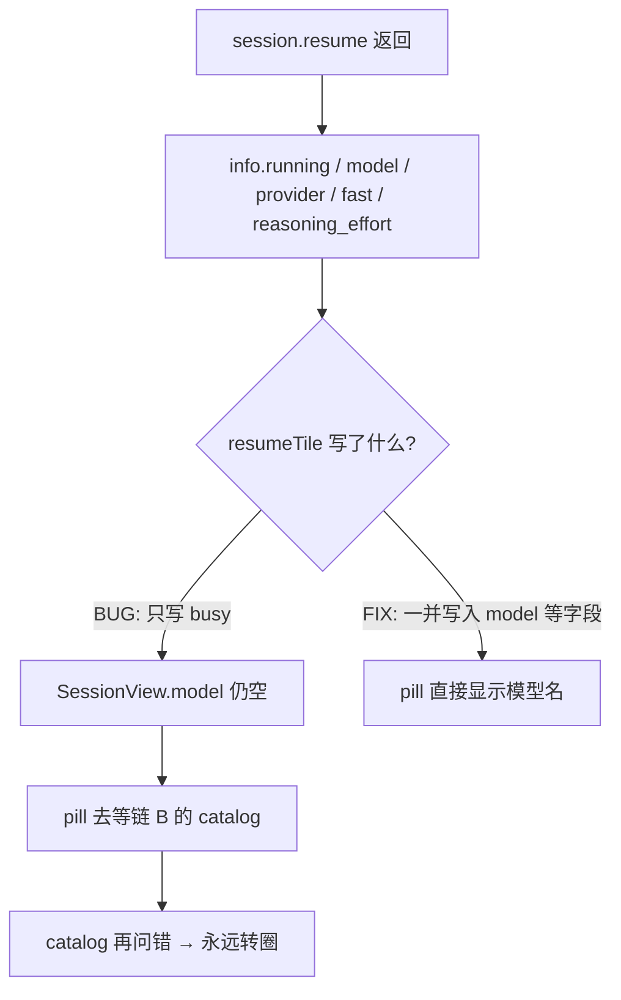
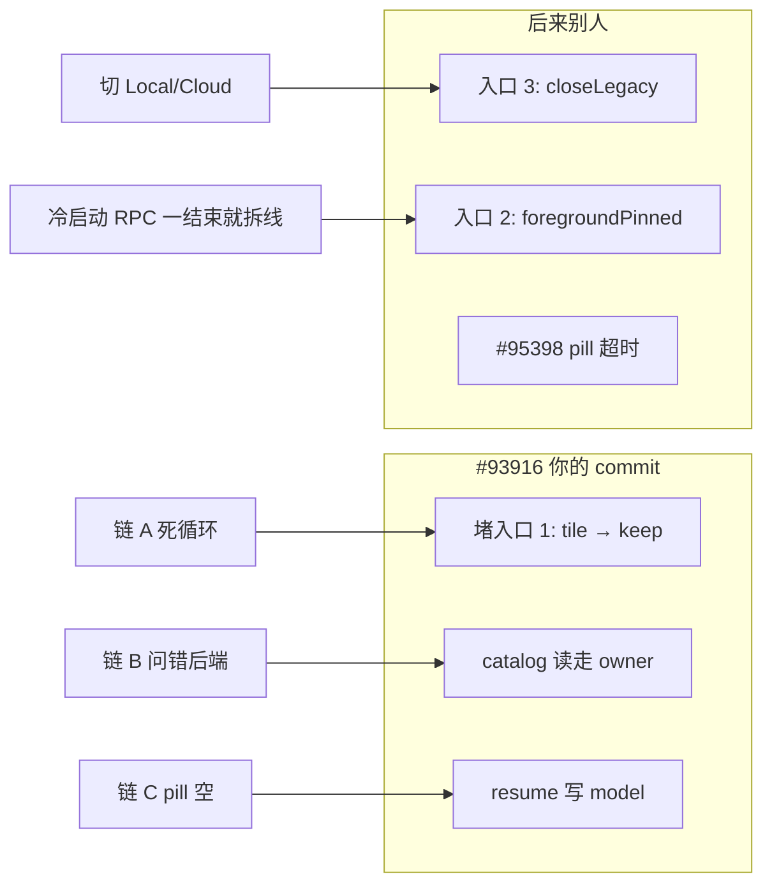

# #93892：次级 profile 的 Bot Chat 永久转圈

个人学习笔记，不是仓库官方文档。对应：

- Issue：https://github.com/NousResearch/hermes-agent/issues/93892
- 原 PR（LovePlayCode）：https://github.com/NousResearch/hermes-agent/pull/93916
- 合入方式：commit `1808d33a24` 被 cherry-pick 进 salvage PR [#95082](https://github.com/NousResearch/hermes-agent/pull/95082)（GitHub 上原 PR 显示 Closed，不等于没修好）
- 作者提交仍在 `main`：`fix(desktop): keep owner-routed tile gateways out of idle prune`

---

## 名词

| 说法 | 是什么 |
|---|---|
| chrome / 窗口 / launch profile | 桌面主窗口当前连着的账号，下文用 **default** |
| 次级 profile | Bots 里点开的另一个账号。测试里叫 **berry**，换成 `coder` 也一样 |
| tile | 分栏里那一块独立聊天窗（Bot Chat 挂在这里） |
| pill | 输入框旁显示当前模型名的胶囊按钮（`model-pill.tsx`）。没名字就转圈 |
| `ModelMenuPanel` | 点 pill 弹出的选模型菜单 |
| `ModelCatalogMenu` | 菜单里画出模型列表的那一层 |
| `request` / RPC | 已打开的 WebSocket 上发 JSON-RPC（这里是 `model.options`） |
| REST | HTTP `GET /api/model/options`，Settings 那种没有聊天 socket 的页面用的；靠 `?profile=` 指定账号 |

Desktop 可以同时连多根 WebSocket：一根是窗口的 **primary**（default），每个有活的其它 profile 再一根 **secondary**。Bot Chat 的 runtime 住在 berry 那根 secondary 上；chrome 可以一直停在 default（`keepAllProfilesScope: true`）。

---

## 流程图

Cursor / GitHub / VS Code 预览 Markdown 时会渲染下面的 Mermaid。

### 0. 出事时谁连着谁



### 1. 链 A：闲清理把眼前这条掐了（#93916 第一刀切断这个环）



### 2. 三扇关 socket 的门（#93916 只堵入口 1）



### 3. 链 B：点 pill 问错后端（#93916 第二刀）



### 4. 链 C：resume 不写模型名（#93916 第三刀）



### 5. #93916 三刀 vs 后来叠的



---

## 结构：一本 socket 表，三个关法

所有次级连接都在 `apps/desktop/src/store/gateway.ts` 的 `g.secondaries`。关掉一条就是 `disposeSecondary()` → `gateway.close()`。

```
屏幕上开着什么
  $sessionTiles / $activeSessionId / create→foreground hold
        │
        ├─ openTileGatewayScopes()          ← #93916 新增
        │     只看 tile.ownerRoute
        │     译成 prune 认识的 key
        │     local：裸名 `berry` + `conn:local::berry`
        │     remote：只有 `conn:homelab::default`（不准带裸 `default`）
        │
        └─ foregroundSessionScopes()        ← 后来 #94370 起，不是 #93916
              主会话 runtime + 每个 tile 的 runtime/route + hold
        │
        ▼
use-gateway-boot.ts
  configureGatewayRegistry({ foregroundScopes: foregroundSessionScopes })

  名单一变 → recomputeKeptGateways()
      keep = liveSessionScopes
           ∪ foregroundSessionScopes        ← 后来并上的
           ∪ openTileGatewayScopes          ← #93916
      pruneSecondaryGateways(keep)          ← 入口 1
        │
        ▼
gateway.ts  g.secondaries

  入口 1  pruneSecondaryGateways（闲连接清理）
    留下：activeKey | keep.has(key) | relay | foregroundPinned | 拨号中 lease
    否则：disposeSecondary()

  入口 2  requestGatewayForAgent 的 finally（RPC 次数归零）
    留下：retained | relay | foregroundPinned | 当前 active
    否则：立刻 disposeSecondary()
    ※ 不看 keep，所以看不到 openTileGatewayScopes

  入口 3  切 Local / Cloud
    closeLegacySecondaryGateways()          ← 只拆旧 v1
    （以前 closeSecondaryGateways() 全拆）
```

`entry.retained` **不能**拿来挡入口 1：hover 预热、切 profile 都会把它设成 true 且不清。prune 若看它，所有暖过的 socket 永远不回收。#93916 故意不碰这面旗。

---

## 问题发生的完整链路（#93892）

用户操作：主窗口停在 default，Bots 打开 berry 的 canonical Bot Chat。聊天已 resume 完，双方发呆（不 busy、不等输入）。

### 链 A — 连接被闲清理掐掉（根因 1）

1. `openGatewayForAgent('local', 'berry')` 拨出 secondary，runtime 挂在这根 WS 上。
2. chrome 的 active profile 仍是 default。
3. boot 里 `recomputeKeptGateways()` 跑 idle prune。当时 keep 只有 busy / needs-input。这条 bot 是 idle，不在 keep 里。
4. `pruneSecondaryGateways` → `disposeSecondary` → berry 的 WS 关。
5. 后端 `tui_gateway`：socket 断了，把刚 resume 的 runtime 当孤儿收掉，推 `session.reclaimed`。
6. 桌面 `lifecycle.ts`：`dropSessionState(runtimeId)` + `unbindTileRuntime(runtimeId)` → tile 的 `runtimeId` 变空。
7. `session-tile.tsx` 的 `useEffect`：gateway 已开且没有 `runtimeId` → `delegate.resumeTile()` 再拨号、再造 runtime。
8. 回到第 3 步。每一步有超时，**整圈没有总预算** → 永久 spinner。

单次失败（非 404、含糊的 404）会变成错误卡 + Retry。永久转圈必须走上面这条「resume 成功 → 被正常 reclaim → 再 resume」的环。

### 链 B — 模型菜单问错后端（根因 2）

tile 的**写**（发消息、换模型）已经走 `requestTileGateway`（按 `ownerRoute` 打到 berry）。

**读**模型目录还在用 `useGatewayRequest()` 的窗口 `gateway`（default）：

```
点 pill
  → ModelMenuPanel（当时传入 ambient gateway）
      → requestModelOptions({ gateway })
          → default 那根 WS 上发 model.options
          → default 进程里没有 berry 的 runtime
          → 空目录 / 错目录
          → REST 兜底也不带 berry 的 profile，再问 launch 账号
```

pill 的规则：`SessionView.model` 有字就显示，没有就转圈，没有超时（`model-pill.tsx`）。

### 链 C — resume 不写模型名，pill 只能等目录

`session.resume` 的响应里已有 `info.model` / `info.provider`。以前 `resumeTile` **只把 `info.running` 写成 busy**。连接一抖、runtime 被收掉再 resume，pill 一直等链 B 那次 catalog。catalog 再问错，pill 也永远转。

---

## #93916 修了什么（三刀，都在 `1808d33a24`）

对应 issue 两个根因。keep-set 只是第一刀。

### 1. 闲着也别掐开着的 tile（堵入口 1 / 链 A）

| 文件 | 改动 |
|---|---|
| `apps/desktop/src/store/session-states.ts` | 新增 `openTileGatewayScopes()` |
| `apps/desktop/src/app/gateway/hooks/use-gateway-boot.ts` | `keep` 并上这些 key；订阅 `$sessionTiles`，tile 开/关就 recompute |

规则：

- local tile：keep 里同时有裸名和 `conn:local::…`（兼容 `openGatewayForProfile` 和 `openGatewayForAgent`）
- remote tile：只有 composite key，避免 homelab 的 `default` 钉住本地另一个 `default`
- 用 `route.profile` 当 socket key，不用 `targetProfile`（后者只改 RPC 参数）
- 关 tile 后下一轮 prune 释放；仅 hover 预热、没有 tile 的仍会 idle prune

### 2. 模型列表去问这条会话的后端（堵链 B）

| 文件 | 改动 |
|---|---|
| `apps/desktop/src/app/chat/session-tile.tsx` | `ModelMenuPanel` 不再传 ambient `gateway`；`profile` 优先 `ownerRoute.targetProfile`，否则 `profile` |
| `apps/desktop/src/app/shell/model-menu-panel.tsx` | 查出、刷新都走 `request: requestGateway` |
| `apps/desktop/src/app/shell/model-catalog-menu.tsx` | 增加 `request` prop，传给 `requestModelOptions` |
| `apps/desktop/src/lib/model-options.ts` | `request` 优先于 `gateway.request`；REST 兜底带上 `profile` |

修好后：

```
点 pill
  → ModelMenuPanel requestGateway={requestTileGateway}
      → requestModelOptions({ request, profile: berry })
          → 先 RPC 到 berry（可带 session_id）
          → 不行再 REST，仍带 berry，不掉回 default
```

`requestModelOptions` 返回的不是 `string[]`，而是目录对象：`providers[]`（菜单要画的 list）+ 当前 `model` / `provider`。

RPC vs REST：同一份目录，WebSocket JSON-RPC 能叠上这条会话的当前模型；HTTP 给没有聊天 socket 的页面用，靠 `?profile=` 选账号。

### 3. resume 把模型标签写进 tile（堵链 C）

| 文件 | 改动 |
|---|---|
| `apps/desktop/src/app/contrib/hooks/use-session-tile-delegate.ts` | 除 `busy` 外，写入 `model` / `provider` / `reasoningEffort` / `fast` |

pill 不必等那次可能问错后端的 catalog。

### 测试（同一 commit）

- `session-states-scopes.test.ts`：local 双 key、remote 不准带裸 `default`、key 用 `profile` 不用 `targetProfile`
- `gateway-connection-scope.test.ts`：homelab 的 default tile 不得钉住本地 default
- `model-options.test.ts`：catalog 走 routed `request`；REST 落到 `berry`
- `use-session-tile-delegate.test.ts`：resume 水合 model/provider
- `contributors/emails/1244224501@qq.com`：作者映射，与行为无关

---

## 这次没修、后来别人叠的

这些 **不是** #93916 没修好 #93892 的意思；是同一本 socket 表上另外两扇门。

| 什么 | 谁 | 堵哪 |
|---|---|---|
| `foregroundSessionScopes` 出生 | #94370，同一 salvage 里排在 93916 **之后** | 入口 3：切 Local/Cloud 时别把还开着的 pane 的 registry socket 全拆 |
| `keep` 并上 `foregroundSessionScopes` | 同上 | 入口 1 上和 `openTileGatewayScopes` 重叠 |
| `foregroundPinned` hook | 更后面 | 入口 2：冷启动 resume 自己拨号，RPC 一结束 `finally` 要拆线；这里只问 `foregroundSessionScopes`，不问 `openTileGatewayScopes` |
| primary 重 home 带走 `activeKey` | salvage follow-up | 93916 那条「remote tile 不得钉本地同名 secondary」测出来的：旧裸名 `default` 会误保/误杀 |
| pill 转圈加超时 / resume 总预算 | [#95398](https://github.com/NousResearch/hermes-agent/pull/95398)（当时仍 open） | issue 建议 3 的兜底；根因连接环已在 #93916 断开 |

关 issue 时有人写成 “prune 现在 honor `retained`”。那是总结写松了。#93916 和当前 `main` 都 **故意不让 prune 看 `retained`**。

---

## 一句话

#93892 是：窗口停在 default，berry 的空闲 Bot Chat 被 idle prune 掐线 → reclaim → 再 resume 死循环；同时 pill 去问 default 的模型目录，resume 又不把模型名写进 tile。

#93916 三刀：tile 开着就进 prune keep；catalog 读写都走 owner；resume 带上 model 标签。

`foregroundSessionScopes` 是后来把「屏幕上还挂着谁」做成一份名单，接到换线路和 RPC lease 归零那两扇门上。入口 1 上现在两边都能保住同一条 berry tile，所以看起来像同一个东西。当初合进去的 winner 是 keep-set 那一刀。
